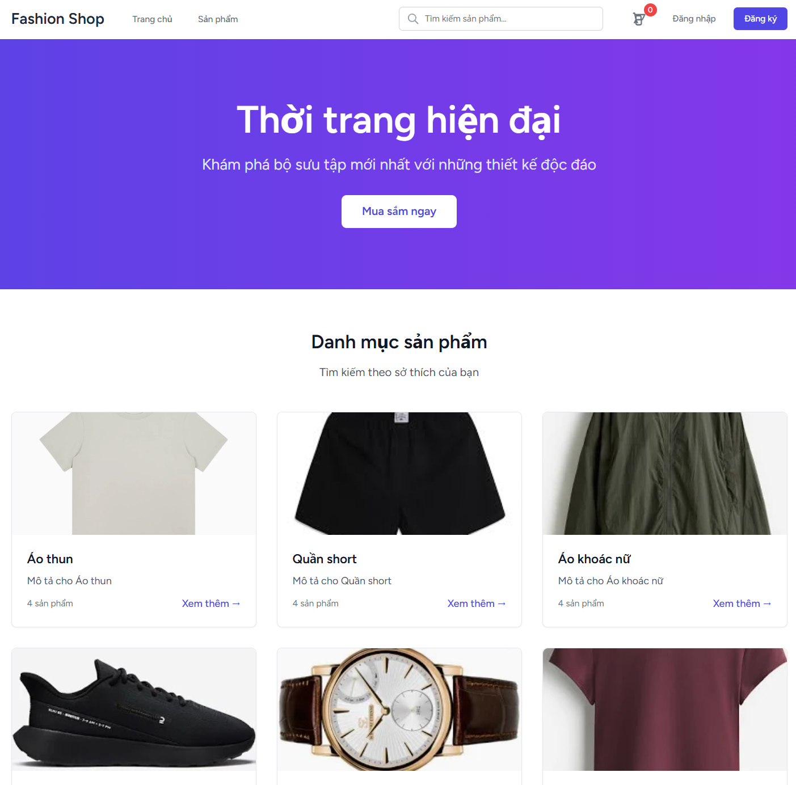
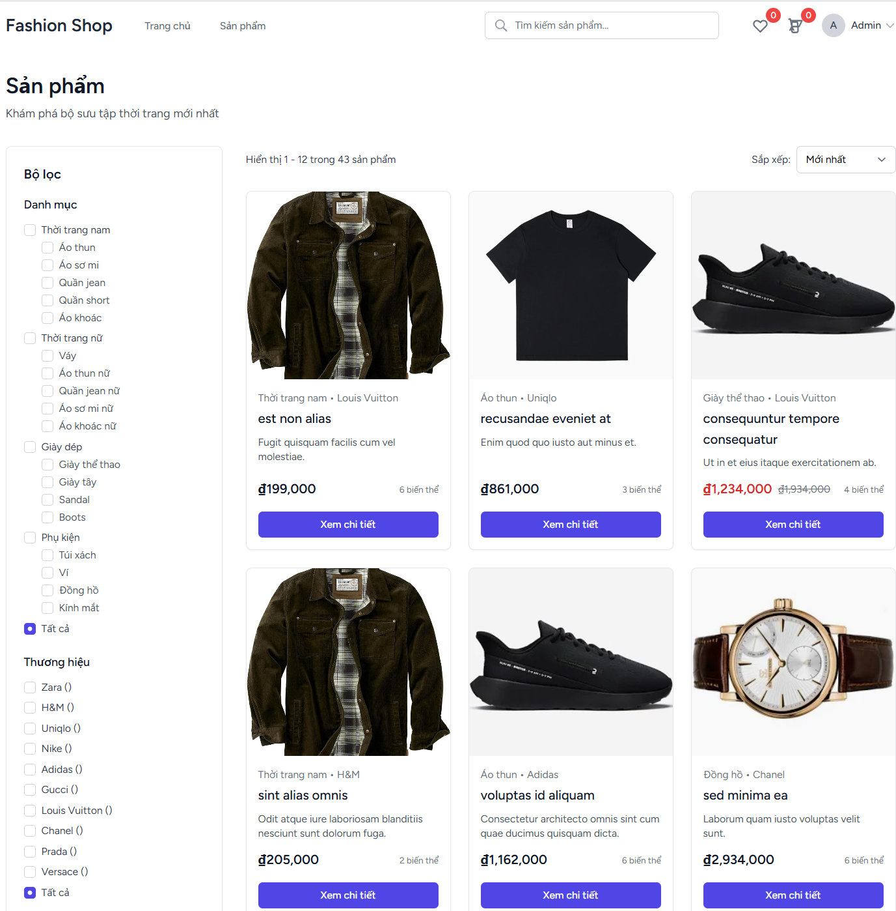
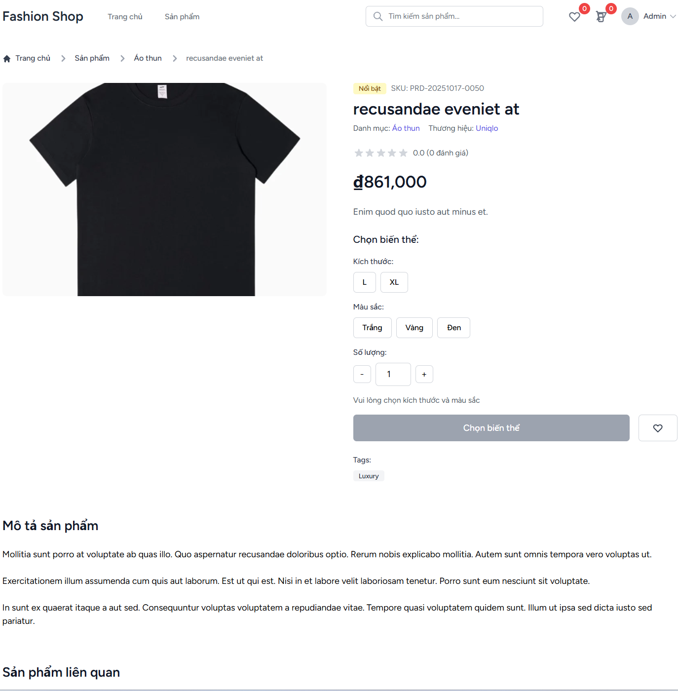
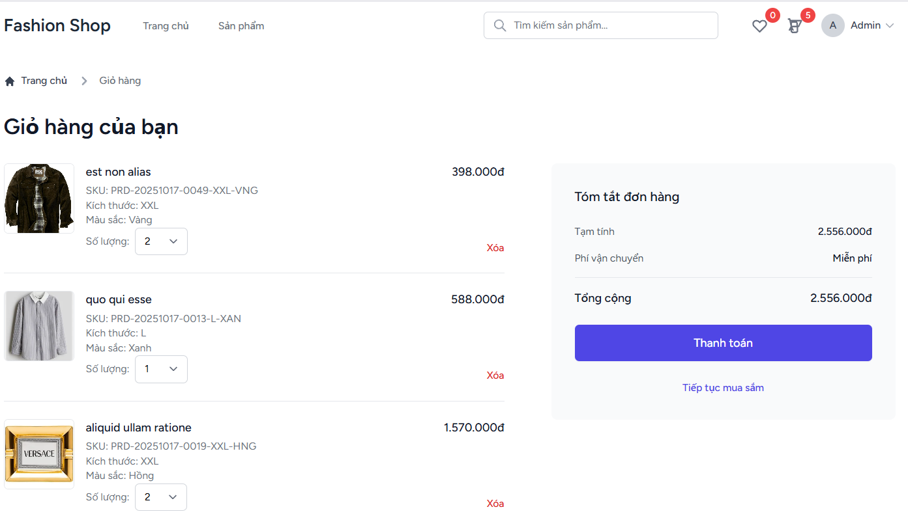
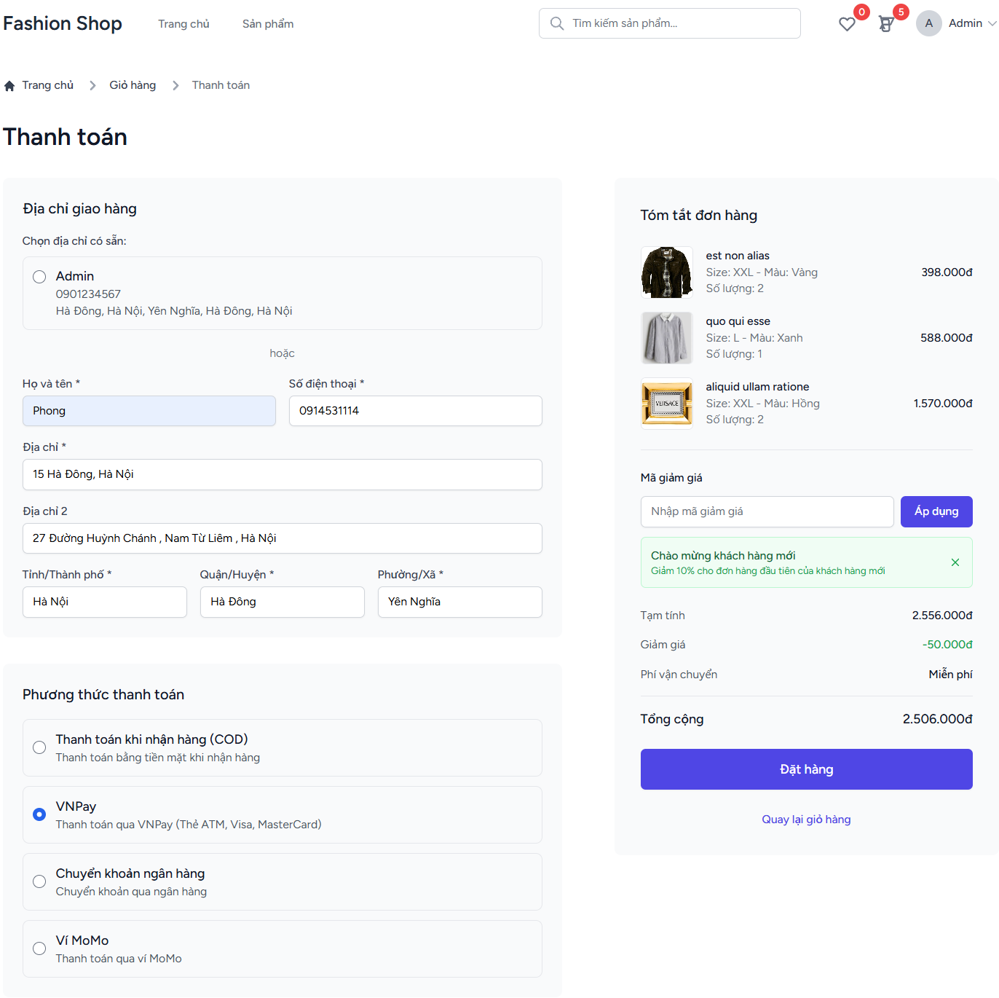
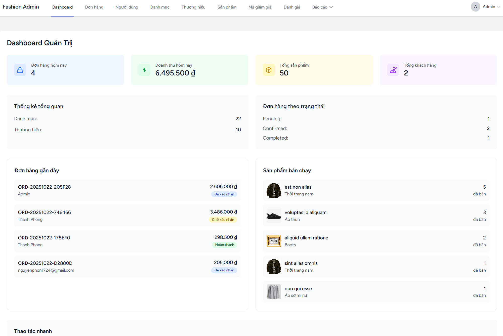
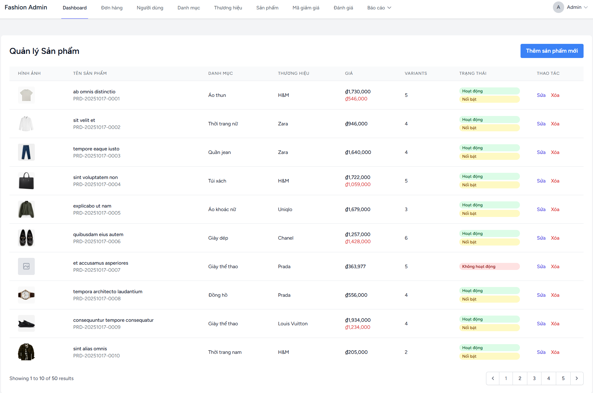
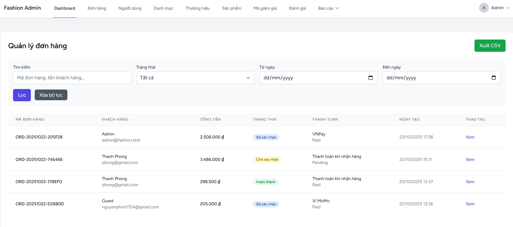

# 🛍️ Fashion Shop - Website Bán Thời Trang Laravel

**TRƯỜNG CÔNG NGHỆ THÔNG TIN PHENIKAA**  
**HỌC PHẦN: THIẾT KẾ WEB NÂNG CAO**  
**Lớp COUR01.TH1 - Nhóm 03**  
**GVHD: Nguyễn Thị Thùy Liên**  
**Thành viên: Nguyễn Thanh Phong (MSSV: 22010251)**

---

## 📋 Mục lục
- [Giới thiệu](#-giới-thiệu)
- [Tính năng](#-tính-năng)
- [Công nghệ sử dụng](#-công-nghệ-sử-dụng)
- [Cài đặt](#-cài-đặt)
- [Cấu hình](#-cấu-hình)
- [Chạy ứng dụng](#-chạy-ứng-dụng)
- [Tài khoản demo](#-tài-khoản-demo)
- [Cấu trúc dự án](#-cấu-trúc-dự-án)
- [Screenshots](#-screenshots)

---

## 🎯 Giới thiệu

Fashion Shop là một website thương mại điện tử chuyên bán các sản phẩm thời trang được xây dựng bằng Laravel 12. Website cung cấp đầy đủ các chức năng cần thiết cho một hệ thống e-commerce hiện đại.

### ✨ Điểm nổi bật
- 🎨 **Giao diện hiện đại**: Responsive design với TailwindCSS
- 🔐 **Bảo mật cao**: Authentication & Authorization với Spatie Permission
- 📱 **Mobile-friendly**: Tối ưu cho mọi thiết bị
- 🚀 **Performance tốt**: Tối ưu database queries và caching
- 🛒 **E-commerce đầy đủ**: Giỏ hàng, checkout, quản lý đơn hàng

---

## 🚀 Tính năng

### 👤 Chức năng người dùng
- **🔐 Authentication**: Đăng ký, đăng nhập, quên mật khẩu
- **🏠 Trang chủ**: Hiển thị sản phẩm nổi bật, danh mục, thương hiệu
- **🛍️ Duyệt sản phẩm**: Danh sách, chi tiết, tìm kiếm nâng cao
- **🛒 Giỏ hàng**: Thêm/xóa/sửa sản phẩm, tính tổng tiền
- **💳 Checkout**: Chọn địa chỉ, phương thức thanh toán
- **📦 Đơn hàng**: Xem lịch sử, chi tiết, hủy đơn
- **❤️ Wishlist**: Danh sách sản phẩm yêu thích
- **⭐ Đánh giá**: Viết review với hình ảnh (chỉ sản phẩm đã mua)
- **👤 Profile**: Cập nhật thông tin cá nhân, địa chỉ

### 👨‍💼 Chức năng admin
- **📊 Dashboard**: Thống kê tổng quan, charts, metrics
- **📦 Quản lý sản phẩm**: CRUD sản phẩm, variants, hình ảnh
- **📂 Quản lý danh mục**: CRUD danh mục, phân cấp
- **🏷️ Quản lý thương hiệu**: CRUD thương hiệu
- **📋 Quản lý đơn hàng**: Xem, cập nhật trạng thái
- **👥 Quản lý người dùng**: Danh sách user, phân quyền
- **🎫 Quản lý mã giảm giá**: CRUD coupon
- **⭐ Quản lý đánh giá**: Duyệt/từ chối review
- **📈 Báo cáo**: Export CSV, thống kê doanh thu

---

## 🛠️ Công nghệ sử dụng

### Backend
- **Laravel 12** - PHP Framework
- **MySQL** - Database
- **Laravel Breeze** - Authentication
- **Spatie Laravel Permission** - RBAC

### Frontend
- **Blade Templates** - Templating Engine
- **TailwindCSS** - CSS Framework
- **Alpine.js** - JavaScript Framework
- **Vite** - Build Tool

### Packages chính
- `spatie/laravel-permission` - Role-Based Access Control
- `spatie/laravel-medialibrary` - Media Management
- `laravel/breeze` - Authentication Scaffold
- `barryvdh/laravel-debugbar` - Debug Tool

---

## 📦 Cài đặt

### Yêu cầu hệ thống
- **PHP**: >= 8.2
- **Composer**: Latest version
- **Node.js**: >= 16.x
- **MySQL**: >= 5.7
- **XAMPP** (khuyến nghị cho development)

### Bước 1: Clone repository
```bash
git clone https://github.com/ThanhPhong1724/FASHION_SHOP
cd fashion-shop
```

### Bước 2: Cài đặt dependencies
```bash
# Cài đặt PHP dependencies
composer install

# Cài đặt Node.js dependencies
npm install
```

### Bước 3: Cấu hình môi trường
```bash
# Copy file .env
cp .env.example .env

# Tạo application key
php artisan key:generate
```

---

## ⚙️ Cấu hình

### Database
Cập nhật file `.env`:
```env
DB_CONNECTION=mysql
DB_HOST=127.0.0.1
DB_PORT=3306
DB_DATABASE=fashion_shop
DB_USERNAME=root
DB_PASSWORD=
```

### Storage
```bash
# Tạo symbolic link cho storage
php artisan storage:link
```

### Database Migration & Seeding
```bash
# Chạy migrations
php artisan migrate

# Chạy seeders
php artisan db:seed
```

---

## 🚀 Chạy ứng dụng

### Development
```bash
# Chạy Laravel server
php artisan serve

# Chạy Vite dev server (terminal mới)
npm run dev
```

Truy cập: `http://127.0.0.1:8000`

### Production
```bash
# Build assets
npm run build

# Optimize Laravel
php artisan config:cache
php artisan route:cache
php artisan view:cache
```

---

## 👤 Tài khoản demo

### Admin
- **Email**: `admin@fashion.test`
- **Password**: `password`

### User
- **Email**: `phong@gmail.com`
- **Password**: `12345678`

---

## 📁 Cấu trúc dự án

```
fashion-shop/
├── app/
│   ├── Http/Controllers/     # Controllers
│   ├── Models/              # Eloquent Models
│   ├── Http/Middleware/     # Custom Middleware
│   └── Policies/            # Authorization Policies
├── resources/
│   ├── views/               # Blade Templates
│   │   ├── layouts/         # Layout files
│   │   ├── products/        # Product views
│   │   ├── admin/           # Admin views
│   │   └── auth/            # Auth views
│   ├── js/                  # JavaScript files
│   └── css/                 # CSS files
├── database/
│   ├── migrations/          # Database migrations
│   └── seeders/             # Data seeders
├── routes/
│   └── web.php              # Web routes
└── public/
    └── storage/             # Symlinked storage
```

---

## 📸 Screenshots

### 🏠 Trang chủ

*Trang chủ với hero section và sản phẩm nổi bật*

### 🛍️ Danh sách sản phẩm

*Grid layout responsive với bộ lọc sidebar*

### 📦 Chi tiết sản phẩm

*Gallery ảnh, chọn variants, thêm giỏ hàng*

### 🛒 Giỏ hàng

*Danh sách sản phẩm, cập nhật số lượng, tính tổng*

### 💳 Checkout

*Form địa chỉ, chọn phương thức thanh toán*

### 👨‍💼 Admin Dashboard

*Thống kê tổng quan với charts và metrics*

### 📦 Admin Products

*Quản lý sản phẩm với CRUD operations*

### 📋 Admin Orders

*Quản lý đơn hàng với trạng thái*

---

## 📊 Thống kê dự án

- **🗄️ Database**: 32 bảng
- **🛣️ Routes**: 50+ routes
- **🎮 Controllers**: 15+ controllers
- **📦 Models**: 20+ models
- **📱 Views**: 30+ Blade templates
- **⏱️ Thời gian phát triển**: 2 ngày
- **👨‍💻 Sprints**: 6 sprints

---

## 🤝 Đóng góp

1. Fork repository
2. Tạo feature branch (`git checkout -b feature/AmazingFeature`)
3. Commit changes (`git commit -m 'Add some AmazingFeature'`)
4. Push to branch (`git push origin feature/AmazingFeature`)
5. Mở Pull Request

---

## 📄 License

Dự án này được phát triển cho mục đích học tập tại **Trường Công nghệ Thông tin PHENIKAA**.

---

## 📞 Liên hệ

**Nguyễn Thanh Phong**  
**MSSV**: 22010251  
**Email**: 22010251@st.phenikaa-uni.edu.vn  
**GVHD**: Nguyễn Thị Thùy Liên

---

## 🙏 Lời cảm ơn

Cảm ơn thầy cô và bạn bè đã hỗ trợ trong quá trình phát triển dự án này.

**⭐ Nếu dự án hữu ích, hãy cho một star!**